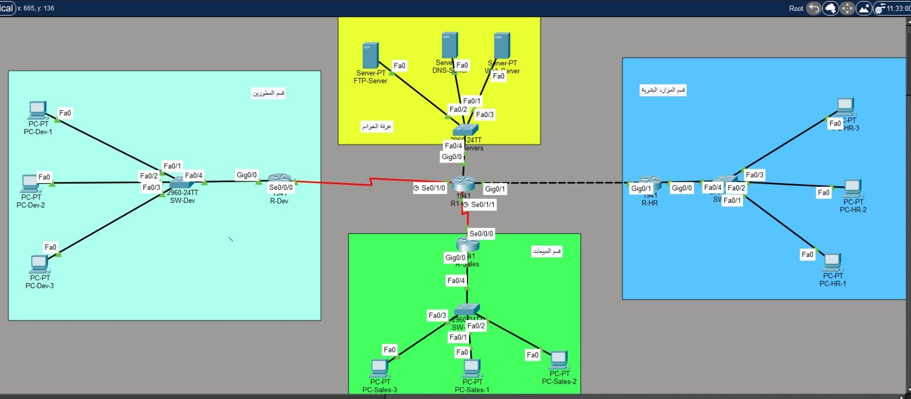
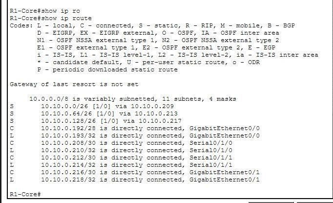
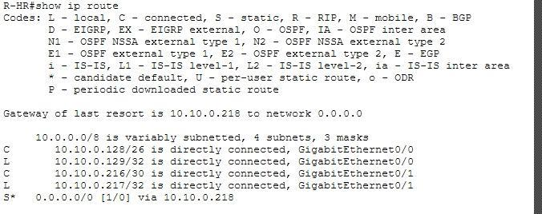
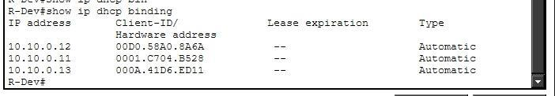
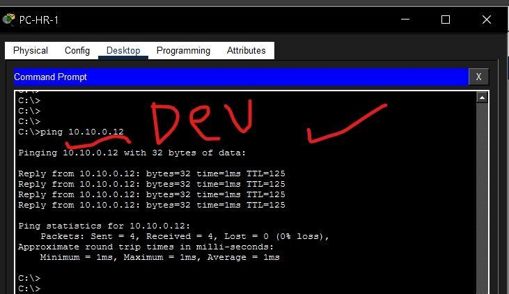
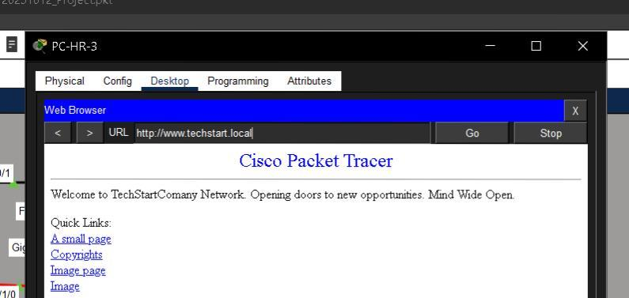
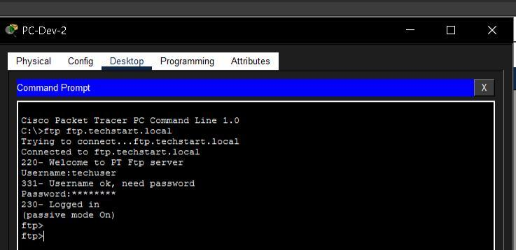
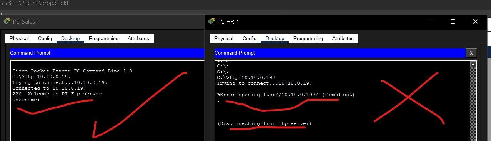
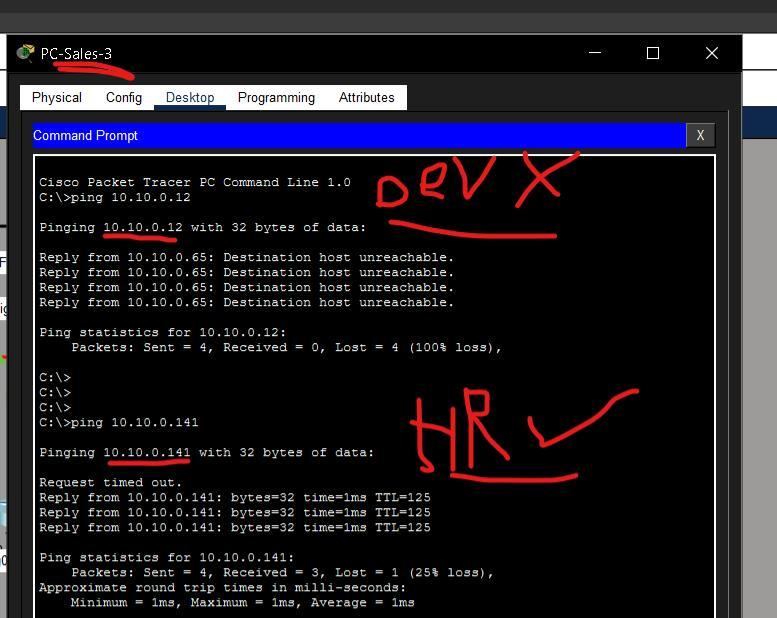

# TechStart Enterprise Network — Cisco Packet Tracer

A complete enterprise network design and implementation for a fictional startup, **TechStart** — The project covers the full lifecycle of a small enterprise network: VLSM addressing, device hardening, DHCP, core services (DNS/HTTP/FTP), static routing, and access-control security — all designed, configured, and verified in Cisco Packet Tracer.



## Scenario

TechStart is a startup with three departments — **Development**, **Sales**, and **HR** — each on its own floor with its own LAN and department router. All three routers connect to a central **Core Router** over point-to-point WAN links, and a dedicated **Server Room** hosts DNS, HTTP, and FTP services shared by the whole company.

The brief: design the full addressing scheme from a single `10.0.0.0/8` block, implement it end-to-end in Packet Tracer, secure every device, automate host addressing with DHCP, stand up the core services, and prove full connectivity across departments.

## Skills Demonstrated

- **VLSM subnetting** — carving one address block into seven right-sized subnets (3 LANs, a server room, 3 WAN links) with zero wasted or overlapping address space
- **Static routing design** — hub-and-spoke routing with default routes on department routers
- **DHCP** — per-department pools with static exclusions for infrastructure addresses
- **Network services** — DNS (A records), HTTP, and FTP configured and verified from client machines
- **Device hardening** — enable secrets, console passwords, login banners, and SSH-only remote access
- **ACLs** (bonus) — extended access lists enforcing two custom security policies between departments

## Addressing Plan (VLSM)

Base network: `10.0.0.0/8` → re-addressed under `10.10.0.0/24` and subdivided by VLSM, largest-to-smallest, to avoid overlap and waste.

| Subnet | Network / CIDR | Mask | First Host | Last Host | Broadcast | Usable Hosts |
|---|---|---|---|---|---|---|
| LAN – Dev | 10.10.0.0/26 | 255.255.255.192 | 10.10.0.1 | 10.10.0.62 | 10.10.0.63 | 62 |
| LAN – Sales | 10.10.0.64/26 | 255.255.255.192 | 10.10.0.65 | 10.10.0.126 | 10.10.0.127 | 62 |
| LAN – HR | 10.10.0.128/26 | 255.255.255.192 | 10.10.0.129 | 10.10.0.190 | 10.10.0.191 | 62 |
| Server Room | 10.10.0.192/28 | 255.255.255.240 | 10.10.0.193 | 10.10.0.206 | 10.10.0.207 | 14 |
| WAN – Dev ↔ Core | 10.10.0.208/30 | 255.255.255.252 | 10.10.0.209 | 10.10.0.210 | 10.10.0.211 | 2 |
| WAN – Sales ↔ Core | 10.10.0.212/30 | 255.255.255.252 | 10.10.0.213 | 10.10.0.214 | 10.10.0.215 | 2 |
| WAN – HR ↔ Core | 10.10.0.216/30 | 255.255.255.252 | 10.10.0.217 | 10.10.0.218 | 10.10.0.219 | 2 |

Full device-by-device IP assignment (routers, switch SVIs, servers, and DHCP-scoped PCs) is documented in [`docs/Networks_Project_Report.pdf`](docs/Networks_Project_Report.pdf).

## Routing Design

Static routing with default routes was chosen over a dynamic protocol like OSPF, for three reasons specific to this topology:

1. **Hub-and-spoke simplicity** — every department router has exactly one physical exit toward the core, so a default route is all that's needed; a dynamic protocol would add complexity with no benefit.
2. **Resource efficiency** — static routes consume no CPU/RAM for route computation and send no periodic updates, preserving WAN bandwidth on the branch links.
3. **Predictability and control** — the network engineer defines every path explicitly, with no exposure to route spoofing from a compromised device — appropriate for a small, tightly-controlled startup network.

## Services

| Service | Configuration |
|---|---|
| **DNS** | A records for `www.techstart.local`, `ftp.techstart.local`, `dns.techstart.local` |
| **HTTP** | Custom landing page served at `www.techstart.local` |
| **FTP** | Dedicated user account with read/write access, reachable at `ftp.techstart.local` |

DHCP hands out addresses automatically to end-user PCs in each department (with the first addresses in each pool excluded for infrastructure); servers and all network infrastructure use static addressing.

## Access Control Lists

Two extended-ACL policies were layered on top of the base routing to demonstrate segmentation:

1. HR is denied access to the FTP server, while every other department retains full access.
2. Sales cannot ping the Dev LAN directly, while all other inter-department traffic remains unaffected.

## Verification

| Test | Result |
|---|---|
| `show ip route` on CORE-R1 | All seven subnets present via static/connected routes |
| `show ip route` on a department router | Default route toward Core installed correctly |
| `show ip dhcp binding` | PCs correctly leased addresses from their department pool |
| Inter-department ping | Dev ↔ Sales ↔ HR all reachable |
| `http://www.techstart.local` | Resolves via DNS and loads the custom page from any department |
| `ftp://ftp.techstart.local` | Login and file access succeed from any department |
| ACL — HR → FTP | Denied (timeout), as designed |
| ACL — Sales → Dev LAN | Denied (unreachable), while Sales → HR remains open |

<table>
<tr><td><br/><sub>show ip route — CORE-R1</sub></td>
<td><br/><sub>show ip route — R-HR</sub></td></tr>
<tr><td><br/><sub>show ip dhcp binding — R-Dev</sub></td>
<td><br/><sub>Inter-department ping test</sub></td></tr>
<tr><td><br/><sub>www.techstart.local via DNS</sub></td>
<td><br/><sub>FTP login and session</sub></td></tr>
<tr><td><br/><sub>ACL: HR denied FTP, Sales allowed</sub></td>
<td><br/><sub>ACL: Sales↔Dev denied, Sales↔HR allowed</sub></td></tr>
</table>

## Repository Structure

```
TechStart-Enterprise-Network/
├── README.md
├── TechStart-Network.pkt        # Cisco Packet Tracer topology file
├── docs/
│   └── Networks_Project_Report.pdf   # Full report: VLSM tables, device address table, DHCP pools, routing justification
└── assets/                       # Screenshots referenced in this README
```

## Tools

Cisco Packet Tracer · Static Routing · VLSM · DHCP · DNS/HTTP/FTP · SSH · Extended ACLs

---
<div align="center">

All rights reserved to Eng.Mohanad Abu Ammar

</div>
